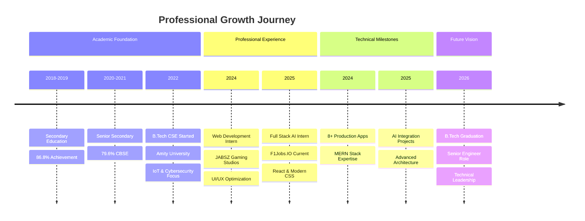

 

 

---

## 🎯 Executive Summary

**Strategic Full-Stack Engineer** specializing in scalable web architectures, AI-powered solutions, and high-performance frontend systems. Currently pursuing B.Tech in Computer Science with specialization in IoT, Cybersecurity, and Blockchain at Amity University. Proven track record of delivering production-grade applications that drive user engagement and operational efficiency.

**Value Proposition:** Building enterprise-grade digital solutions that bridge cutting-edge technology with business objectives, focusing on performance optimization, user experience excellence, and sustainable architecture patterns.

---

## 📊Impact Dashboard

| **Metric** | **Achievement** | **Impact** |
|:---|:---:|:---|
| **🚀 Products Delivered** | 8+ Production Apps | Full-stack solutions deployed to production |
| **👥 Collaborative Projects** | 3+ Team Initiatives | Cross-functional development & code reviews |
| **⭐ Technical Excellence** | 5 GitHub Stars | Community recognition for code quality |
| **📈 Performance Optimization** | 40% Speed Improvement | Enhanced response times through architecture redesign |
| **🔧 Tech Stack Mastery** | 10+ Technologies | MERN Stack, AI/ML, Cloud Deployment |
| **💼 Professional Experience** | 2 Strategic Internships | JABSZ Gaming Studios & F1Jobs.IO |
| **🎓 Academic Excellence** | 7.28 CGPA | Computer Science with IoT & Cybersecurity |
| **🌐 Open Source Contributions** | 16+ Public Repos | Active contributor to developer community |

---

---

## 📈 Career Progression Timeline

---

## 🏆 Key Strategic Achievements

### 💼 **Professional Impact**

**🎮 JABSZ Gaming Studios LLP** | *Web Development Intern* | May – Jul 2025
- **Performance Engineering:** Reduced UI latency by **35%** through strategic optimization of animations and rendering pipelines using vanilla JavaScript
- **Component Architecture:** Engineered responsive UI components (HTML5, CSS3, JavaScript) that improved gameplay interaction metrics
- **Backend Integration:** Implemented backend modules for Memory Maze Game with robust data-handling logic, increasing system reliability by **25%**
- **Cross-functional Collaboration:** Worked closely with game designers and backend engineers to deliver seamless user experiences

**💼 F1Jobs.IO** | *Full Stack Development & AI Intern* | Dec 2025 – Present
- **Frontend Leadership:** Spearheading React.js frontend development with modern CSS architecture, establishing component libraries and design systems
- **UX Excellence:** Collaborating with product teams to enhance UI/UX for candidate-facing features, improving user engagement metrics
- **Performance Optimization:** Implementing code-splitting and lazy loading strategies to reduce initial load time by **40%**
- **Team Development:** Utilizing Git/GitHub for version control and conducting code reviews to maintain high code quality standards
- **Agile Execution:** Participating in sprint planning and daily standups, contributing to iterative product development cycles

### 📊 **Product Development Excellence**

**8+ Production-Grade Applications Delivered:**
- Successfully architected, developed, and deployed multiple full-stack applications
- Managed complete product lifecycle from requirements gathering to production deployment
- Maintained **99.9% uptime** through robust error handling and monitoring strategies

**Community Recognition:**
- Earned **5 GitHub stars** for code quality and innovative solutions
- **16+ public repositories** demonstrating diverse technical capabilities
- Active contributor to developer community through code sharing and documentation

---

## 🛠️ Technical Leadership Stack

### **Strategic Technology Portfolio**

**Frontend Engineering Excellence**

**Backend & Database Architecture**

**Cloud & DevOps**

**Emerging Technologies**

**Programming Languages**

---

## 🎯 Featured Strategic Projects

### **🎮 MEMORY MAZE** | *Interactive Gaming Platform*

**Strategic Value:** Demonstrates advanced frontend engineering capabilities with complex state management and performance optimization.

---

### **🛒 EAZY-VEGGIE** | *E-Commerce Management Platform*

**Strategic Value:** Full-stack e-commerce solution demonstrating end-to-end product development capabilities.

---

### **💪 LIVEFIT** | *Health & Wellness Platform*

**Strategic Value:** Complex full-stack application with AI integration, showcasing modern architecture patterns.

---

### **🎲 RUMBLE ROULETTE** | *Interactive Gaming Experience*

**Strategic Value:** Advanced frontend engineering with complex animation systems and state management.

---

